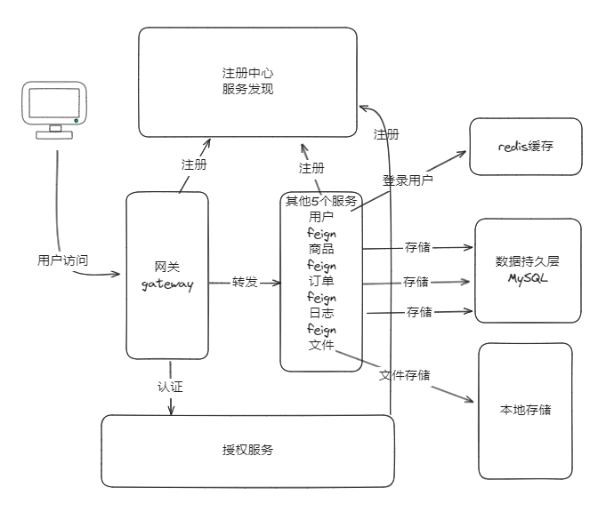

## 平台简介

微服务架构-简易商城系统。

* 采用前后端分离的模式，微服务版本( [shop-cloud](https://gitee.com/svipdada/shop-cloud-vue.git))。
* 后端采用Spring Boot、Spring Cloud & Alibaba。
* 注册中心、配置中心选型Nacos，权限认证使用Redis。
* 持久层框架选型MyBatis-Plus，事务选型注解式，数据库选用MySQL。
* 支持国际化，中/英切换。

## 系统模块

~~~
com.shop     
├── shop-admin           // 后台系统 [5073]
├── shop-web             // 前台系统 [50743]
├── shop-gateway         // 网关模块 [8081]
├── shop-auth            // 认证中心 [9000]
├── shop-api             // 接口模块
│       └── shop-api-user                            // 用户feign接口
│       └── shop-api-goods                           // 商品feign接口
│       └── shop-api-logs                            // 日志feign接口
│       └── shop-api-order                           // 订单feign接口
├── shop-common          // 通用模块
│       └── shop-common-core                         // 核心模块
│       └── shop-common-redis                        // 缓存服务
│       └── shop-common-security                     // 安全模块
├── shop-modules         // 业务模块
│       └── shop-modules-file                        // 文件服务 [9300]
│       └── shop-modules-goods                       // 商品服务 [9202]
│       └── shop-modules-logs                        // 日志服务 [9205]
│       └── shop-modules-order                       // 订单服务 [9203]
│       └── shop-modules-user                        // 用户服务 [9201]
├──pom.xml                                           // 公共依赖
~~~

## 后台系统内置功能
1.  登录&注册：后台系统管理员登录。
2.  用户管理：后台系统管理员登录能搞对用户进行维护。
3.  商品类型：商品类型管理，可以维护商品类型。
4.  商品管理：商品管理，可以维护商品信息。
5.  订单管理：订单管理，可以维护订单信息，操作订单状态。
6.  个人中心：修改基本信息，修改密码。

## 前台系统内置功能
1.  登录&注册：前台系统管理员登录。
2.  首页：分页展示后台系统录入的商品信息。
3.  商品分类：分组展示商品类型，支持关键词搜索。
4.  购物车：商品详情页选择商品属性加入购物车，进行计算价格。
5.  我的订单：订单管理，可以维护订单信息，操作订单状态。
6.  我的地址：对自己的地址进行维护，包括crud。
7.  个人中心：修改基本信息，修改密码。

## 架构图

